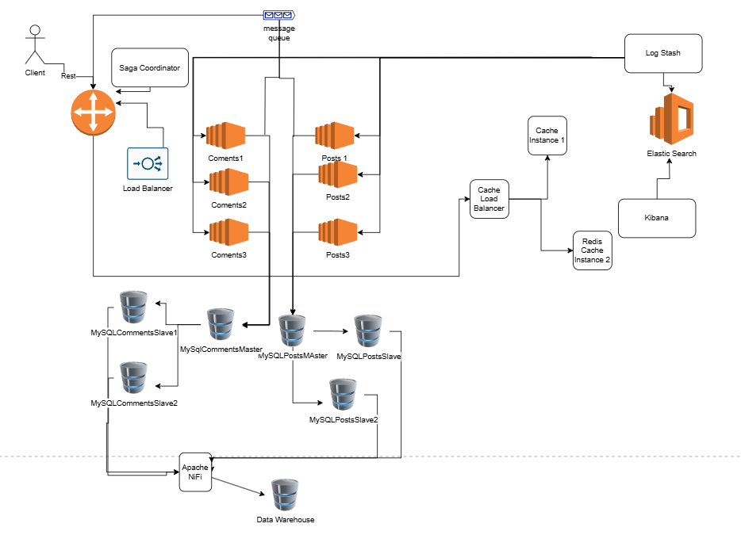

#  Lab 1 - Web Proxy
## Checkpoint 1
### Topic: MeoWorld: A Simple Cat-Themed Blogging Platform

## Application Suitability
Cats are a popular topic online, which makes this blog appealing to many users. 
This blog allows users to interact with the content through comments and likes, helping the community of cat lovers to grow.
- Necessity of Distributed Systems
1. Scalability, as the number of users increses, the number of posts will grow, so a distributed system will help manage this flow.
2. Reliability, by separating the functionals( post management, user interactions, and media handiling) the platform
will remain stable, in case one of the parts encounters issues.
3. Flexibility, different services can be updated or scaled independently, allowing for easier maintenance.
4. Performance: distributing tasks across different services ensures faster load times and better performance for users.
### Real-world examples:
### Medium
- Post Creation: A separate service handles writing, saving drafts, and editing articles.
- User Accounts: User registation, logins and profile updates are managed by a separate service.
- Comments: Because comments and reactions are managed by a different service, it doesn’t affect the main publishing system.

### Blogger.com
- Post Creation: A separate service handles creating, editing, and managing blog posts.
- Comments: Comments are managed by a different service, so the main blog remains fast.
- Media Uploads: Images and videos are handled by their own service, which processes and stores them.

## Service Boundary

## Technology Stack and Communication Patterns
- Services will be written in C# with .NET Framework and use gRPC for running the services defined in proto files.
- The gateway will be written in GO;
- Gateway will expose to the external users a RESTful API, based on proto files and with the internal services will communicate via gRPC and protobuf, as this protocol is faster and smaller in size than json.
- The data will be stored in a small database, like SQLite.
- Status Endpoint. Health status will be provided using built-in gRPC functionalities. As an example: a service will respond with Serving when it can accept new requests, and NotServing - otherwise.
- Timeout. The timeout will be set via gRPC, using GRPC built-in call options.
- Current task limit. gRPC functional will be used to control the number of connexions.
- Service Discovery will send messages to the message queue, and this way, the load balancer will know who to track and perform health checks on.
- The Circuit Breaker, the client, the gateway, will save in the cache if a certain service does not respond. It will also calculate if this happened three times within a certain period, and then it will notify about this.
- Unit test. For the post service I will do the unit tests in C#, to test if the requests are working correctly.
- Health Monitoring and Alerts. Using gRPC we can track the number of incoming requests and adjust the service status based on traffic load. gRPC health check service using the grpc.health.v1.Health plugin
- In gRPC, load balancing with weighted round robin ensures that requests are directed only to services that are available and capable of handling them, as opposed to sending requests evenly across all services. This approach improves the efficiency of request distribution by prioritizing less loaded or more capable instances.
- The cache will also collect data from the get requests, because they are not that often changed.
## Data Management (Database + Endpoints)
Below, in the proto files, the services, their endpoints, and respective requests, responses, and data structures are defined. The service will provide endpoints for managing posts in a CRUD style. Additionally, the WebSocket implementation will follow this structure:

- The client connects to the gateway using the WebSocket protocol.
- The gateway then utilizes the streaming feature in proto/gRPC to receive unidirectional messages from the services.

```proto
syntax = "proto3";
package meoworld;

service Blog {
  rpc PublishPost( PublishPostRequest ) returns ( PublishPostResponse ) {
    option (google.api.http) = {
      post: "/v1/blog/post"
      body: "*"
    };
  }
  rpc EditPost( EditPostRequest ) returns ( stream EditPostRequest ) {
    option (google.api.http) = {
      post: "/v1/blog/post/{guid}/edit"
      body: "*"
    };
  }
  rpc DeletePost( DeletePostRequest ) returns ( stream DeletePostRequest ) {
    option (google.api.http) = {
      post: "/v1/blog/post/{guid}/delete"
      body: "*"
    };
  }
  rpc ListPosts( ListPostsRequest ) returns ( ListPostsResponse ) {
    option (google.api.http) = {
      get: "/v1/blog/post"
    };
  }
  rpc GetPost( GetPostRequest ) returns ( GetPostResponse ) {
    option (google.api.http) = {
      get: "/v1/blog/post/{guid}"
    };
  }
  rpc Listen( ListenRequest ) returns ( stream ListenRequest ) { }
}

message PublishPostRequest {
  string title = 1;
  string content = 2;
}
message PublishPostResponse {
  string guid = 1;
}

message EditPostRequest {
  string guid = 1;
  string title = 2;
  string content = 3;
}
message EditPostResponse {
  // Empty
}

message DeletePostRequest {
  string guid = 1;
}
message DeletePostResponse {
  // Empty
}

message ListPostsRequest {
  // filters
  uint8 limit = 1;
  google.protobuf.Timestamp after_time = 2;
  google.protobuf.Timestamp before_time = 3;
}
message ListPostsResponse {
  repeated BlogPost posts = 1;
}

message GetPostRequest {
  string guid = 1;
}
message GetPostResponse {
  BlogPost post = 1;
}

message ListenRequest {
  repeated ListenType types = 1;
}
message ListenRequest {
  ListenType type = 1;
  // The data will be parsed to a special message, based on message type.
  byte data = 2;
}

// Types (should be separate file, but keep it here for simplicity)
message BlogPost {
  string guid = 1;
  uint64 owner_id = 2;
  string title = 3;
  string content = 4;
  google.protobuf.Timestamp creation_time = 5;
  google.protobug.Timestamp = last_edited_time = 6;
}

enum ListenType {
  LISTEN_TYPE_UNSPECIFIED,
  LISTEN_TYPE_NEW_POST,
}

message NewPostNotification {
  string guid = 1;
}
```

The "comments" service will handle the management of blog post 
comments, offering endpoints for CRUD operations.
```proto
syntax = "proto3";
package meoworld;

service Comments {
  rpc AddComment( AddCommentRequest ) returns ( AddCommentResponse ) {
    option (google.api.http) = {
      post: "/v1/comment"
      body: "*"
    };
  }
  rpc ListComments( ListCommentsRequest ) returns ( ListCommentsResponse ) {
    option (google.api.http) = {
      get: "/v1/comment/{post_guid}"
    };
  }
  rpc EditComment( EditCommentRequest ) returns ( EditCommentResponse ) {
    option (google.api.http) = {
      post: "/v1/comment/{guid}/edit"
      body: "*"
    };
  }
  rpc DeleteComment( DeleteCommentRequest ) returns ( DeleteCommentResponse ) {
    option (google.api.http) = {
      post: "/v1/comment/{guid}/delete"
      body: "*"
    };
  }
}

message AddCommentRequest {
  string post_guid = 1
  string content = 2;
  string reply_guid = 3;
}
message AddCommentResponse {
  string guid = 1;
}

message ListCommentsRequest {
  string post_guid = 1;
}
message ListCommentsResponse {
  repeated Comment comments = 1;
}

message EditCommentRequest {
  string guid = 1
  string content = 2;
}
message EditCommentResponse {
  // Empty
}

message DeleteCommentRequest {
  string guid = 1
}
message DeleteCommentResponse {
  // Empty
}

// Types
message Comment {
  string guid = 1;
  string post_guid = 2;
  // The comment guid to which it responds
  string reply_guid = 3;
  uint64 owner_id = 4;
  string content = 5;
  google.protobug.Timestamp creation_time = 6;
  google.protobug.Timestamp last_edited_time = 7;
}
```
## Deployment and Scaling
- Whole app will be deployed using docker and docker compose: 
gateway, each instance of services will have their own container 
and communicate through the same internal docker network. 
Only the gateway will be exposed, to ensure no one has direct 
acces to the internal services.
- The database will be stored in a docker volume shared among 
containers with respective service, posts db for posts services
and comments db for comments service.
